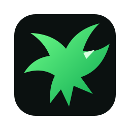

<p align="center">
  
</p>
<h1 align="center">Drayven Engine</h1>
<p align="center"><b>C++ game engine + ImGui editor + DRYS native scripting</b><br/>Copyright © 2026 DeathAmir</p>

<p align="center">
  
  
  
  
  
</p>

Drayven Engine is a native C++20 game-engine foundation focused on fast iteration, readable project layout and native shipping. The editor uses Dear ImGui docking, projects can target 2D or 3D workflows, and gameplay can be written in **DRYS / Drayven Script**, which is transpiled to C++ before the final native build.

## Highlights

- Unity-style dockable editor shell: Hierarchy, Inspector, Asset Browser, Console, DRYS editor and Build/Export window.
- 2D and 3D project templates with entity transforms and component-ready scene data.
- DRYS lexer + transpiler with variables, functions, conditions, loops, expressions and game API bindings.
- `drayvenc` CLI for project creation, transpilation, asset packing and platform staging.
- Protected `.dpack` asset containers for textures, audio, fonts and other runtime data.
- Desktop CMake flow for Windows and Linux.
- Android exporter that validates Android SDK + NDK requirements before generating staging files.
- English/Persian editor localization hooks; Persian visual-order shaping helper and optional Vazirmatn font loading.
- GitHub Actions matrix builds and automatic release artifacts from `main`.

## Build the engine

```bash
cmake -S . -B build -DCMAKE_BUILD_TYPE=Release
cmake --build build --config Release --parallel
ctest --test-dir build -C Release --output-on-failure
```

Executables are generated under `build/bin`.

## DRYS in 30 seconds

```drys
game Player
var speed = 5

fn start()
    log("Hello from Drayven")
end

fn update(dt)
    if key_down("D")
        move_x(speed * dt)
    end
end
```

Transpile manually:

```bash
drayvenc transpile Scripts/Main.drys -o Build/Generated/Main.cpp
```

See [DRYS language guide](docs/DRYS.md).

## Create a project

```bash
drayvenc new ./Games/MyGame MyGame 2d
drayvenc new ./Games/My3DGame My3DGame 3d
```

Each project contains `Assets/`, `Scripts/`, `Scenes/` and `Build/`. In the editor you can choose the project path and name from the Welcome window.

## Assets and release packaging

`drayvenc pack` recursively packages project assets into a `.dpack` container. DRYS is translated to C++ into `Build/Generated`, so release builds do not need to contain readable script source.

```bash
drayvenc pack Assets Build/GameAssets.dpack my-project-key
```

The included stream protection is intended to deter casual extraction; projects requiring strong anti-tamper guarantees should layer platform signing and a dedicated authenticated-encryption/key-management solution on top.

## Persian / فارسی

The editor includes English and Persian strings. Place `Vazirmatn-Regular.ttf` under `assets/fonts/` to enable the intended Persian glyph coverage. The font binary is not vendored by this repository; keep its upstream license when redistributing it.

## Android

Android export expects the SDK and NDK to be installed. Set `ANDROID_SDK_ROOT` or `ANDROID_HOME` and run:

```bash
drayvenc build MyGame.drayven --target android
```

Read [Android export notes](docs/ANDROID.md) before shipping an APK/AAB.

## Repository layout

```text
include/drayven/       Public engine API
src/core/              Project, scene, localization
src/runtime/           SDL3 runtime and renderer entry points
src/editor/            Dear ImGui editor
src/drys/              DRYS lexer/transpiler
src/pack/              .dpack container
src/cli/               drayvenc
assets/                 Editor/runtime assets
templates/              2D/3D starter projects
docs/                   Language and architecture docs
.github/workflows/       CI + release automation
```

## Current scope

This first native foundation intentionally leaves full production rendering, physics, animation, networking, importers, prefab serialization, material graphs, visual scripting and signed Android APK/AAB generation for subsequent engine milestones. The current 2D/3D renderer entry points are scaffolding for those backends rather than a finished Unity-equivalent renderer.

---

**Drayven Engine — By DeathAmir**
